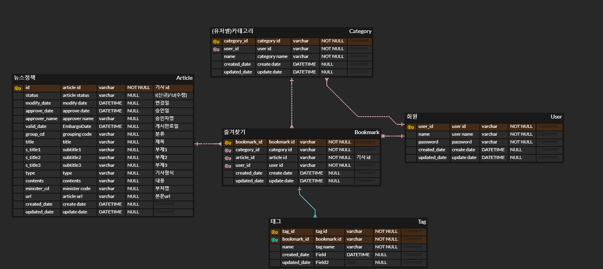

# 공공데이터포털 API를 활용한 정책뉴스 관리 서비스
뉴스기사를 조회하고 카테고리 별로 즐겨찾기하여 관리할 수 있는 서비스

## 프로젝트 기능 및 설계

1. 회원 관리
- 회원가입 기능
  - 입력항목 : 아이디, 패스워드
  - 제한사항 : 아이디는 중복될 수 없다.

- 로그인 기능

- 마이페이지
  - 카테고리 기능 (유저별 생성)
    - 카테고리 등록 / 수정 / 삭제 기능
    - 카테고리 별로 즐겨찾기 한 기사를 조회

-----------------------------------------------------------------------------
2. 정책뉴스 조회
- 로그인하지 않은 사용자도 조회 권한을 가진다.

- 필수조회 조건 : 기간일자 (1일씩 조회)

- 건수가 많을 수 있으므로 paging 구현한다. (단, size/sort는 고정)

- 조회 기능
  - 공공데이터포털의 API를 통해 데이터를 조회해온다.
  - 해당일자에 이미 받아온 데이터 존재 시에는 내부 DB에서 조회한다.
  - redis 캐쉬 만료 시간 이후에는 신규 건은 insert, 수정 건은 update 처리하여 내부DB에 저장한다.

  - [문화체육관광부_정책브리핑_정책뉴스_API]
    - https://www.data.go.kr/data/15095335/openapi.do#tab_layer_recommend_data
 
-----------------------------------------------------------------------------
3. 정책뉴스 즐겨찾기 기능
- 로그인한 사용자만 즐겨찾기 권한을 가진다.
    
- 즐겨찾기 등록 기능 
  - 카테고리 필수 선택 후 선택적으로 태그를 입력하고 저장할 수 있다.

- 즐겨찾기 수정 기능
  - 카테고리 및 태그 내용을 수정할 수있다.

- 즐겨찾기 삭제 기능
  - 즐겨찾기한 기사를 해제할 수 있다.
    
-----------------------------------------------------------------------------
4. 통계 데이터
 - 인기 뉴스 조회
   - 전체 즐겨찾기 데이터 수를 집계하여 즐겨찾기 등록된 뉴스 TOP 10 및 하위 태그 데이터를 조회한다.
    (즐겨찾기 횟수는 즐겨찾기 테이블 데이터를 연산하여 계산)

-----------------------------------------------------------------------------
## ERD 

https://www.erdcloud.com/d/gYamsMQ8ieR44Fojm

## Trouble Shooting
[go to the trouble shooting section](doc/TROUBLE_SHOOTING.md)

### Tech Stack

 
   
   
   
  

